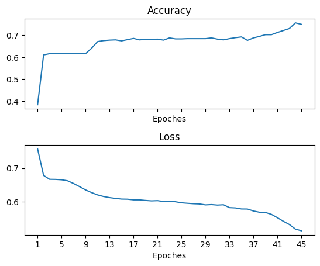

# Titanic Survival Classification
This projects is a simple classification with a multilayer perceptron (MLP) on [Titanic dataset](https://www.kaggle.com/competitions/titanic/data). The MLP model consists of two layer [128, 8] and optimizer of model is Adam.
## Train results
Train results with 6 feauture for input and $\alpha$ = 0.001 are:

## Test evaluation
| Loss | Accuracy |
| ------ | ----------- |
|0.4850 |0.8110|
